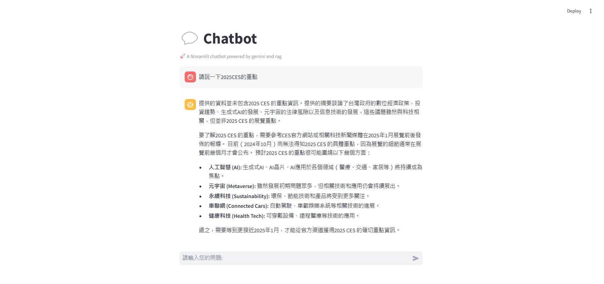

# RAG_chatbot
🚀 Chatbot 應用!💬
這個應用結合了 Google Gemini 和 RAG（Retrieval-Augmented Generation）技術，為您提供更智能、更準確的對話體驗。
## 主要功能
1. Google Gemini API
Chatbot 使用 Google Gemini API 來生成回應。這意味著它可以理解並生成自然語言，提供更流暢和人性化的對話體驗。
2. Google Custom Search API
當 Chatbot 需要更多資訊時，它會使用 Google Custom Search API 來檢索網路上的相關資料。這確保了它能夠提供最新和最準確的資訊。
3. Retrieval-Augmented Generation (RAG)
Chatbot 結合了 RAG 技術，這意味著它不僅能生成回應，還能檢索並整合網路上的資訊，提供更豐富和有深度的回答。

## 預覽畫面

## 如何使用
執行 streamlit run gemini_rag.py
輸入您的問題：在應用的輸入框中輸入您的問題。
等待回應：Chatbot 會分析您的問題，檢索相關資訊並生成回應。
查看結果：您將會看到 Chatbot 的回應，包含檢索到的相關資訊和生成的回答。

## 技術細節
Google Gemini API：用於生成自然語言回應。
Google Custom Search API：用於檢索網路上的相關資訊。
Streamlit：用於構建應用的前端界面。
dotenv：用於管理環境變數，確保 API 金鑰的安全性。

## 環境設置
安裝所需的 Python 套件：

`pip install google-generativeai streamlit google-api-python-client python-dotenv`

創建 .env 文件並添加您的 API 金鑰：

`gemini_key=YOUR_GEMINI_API_KEY`

`google_search_api=YOUR_GOOGLE_SEARCH_API_KEY`

`google_CSE_ID=YOUR_GOOGLE_CSE_ID`

## 結語
這個 Chatbot 應用旨在提供更智能和準確的對話體驗。無論您是需要查詢資訊還是進行對話。立即試用，體驗全新的對話方式吧！
